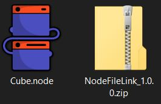

### Introducing `.node`

*Package, share, and distribute Geometry Node groups across the Blender community.*

Instead of spending time appending node groups you can now use `.node` as a simple and portable file that you can *import* or *export* at will with one simple action.

> *Check [Releases](https://github.com/nicolaiprodromov/dot_node/releases) for the latest version.*

###

<a href="https://github.com/nicolaiprodromov/dot_node/releases" style="text-decoration: none; color: #ff6600; display: block;">
Get for Free
</a>

<a href="https://superhivemarket.com" style="text-decoration: none; color: #ff6600; display: block;">
Buy on Superhive
</a>

<a href="https://blenderkit.com" style="text-decoration: none; color: #ff6600; display: block;">
Buy on BlenderKit
</a>

###

- **One-Click Import**: Drag and drop `.node` files directly into Blender
- **Complete Packaging**: All node data, connections, and metadata in one file
- **Version Control Ready**: Perfect for Git workflows and collaborative projects
- **Community Standard**: Establish a unified format for the entire nodes ecosystem
- **Lightning Fast**: No more hunting through blend files, just instant access to node groups

## How to

### Install

1. **Download** the latest release from [Releases](https://github.com/nicolaiprodromov/dot_node/releases)
2. **Install** via Blender → Edit → Preferences → Add-ons → Install
3. **Enable** the "Node File Link" addon
4. **Enjoy** seamless `.node` file support!

###

### Import & Export

- **IMPORT**:
    1. Drag & Drop the nodes you want to import
- **EXPORT**:
    1. Select the node/nodes you want to export
    2. Right click > Export Node Groups

###

## 🌟 The file

It's designed to become the **standard** for sharing Blender procedural node group setups and make Geometry Nodes accessible to the web.

> More than just a file type, a **community initiative** to standardize how we share and collaborate using procedural setups in Blender.

A `.node` file is a lightweight, portable package for sharing procedural node group setups with all the data, connections, and metadata. Technically, it's a ZIP archive containing three essential components:

- a `.json` metadata file with nodes structure and properties
- a `.blend` file with the actual node group data
- a `.config` file for package validation.

This format enables seamless sharing and importing across different Blender projects (soon enough, different software too) without complex file dependencies or incompatibility issues.

### Features

| Feature | Description |
|---------|-------------|
| **Export** | Convert any Geometry Node group to `.node` format |
| **Import** | Seamlessly import `.node` files with full fidelity |
| **Drag & Drop** | Native file association for instant workflow integration |
| **Metadata** | Preserve all node properties, connections, and interface definitions |
| **Cross-Platform** | WIP -> Works only on Windows atm|

### Roadmap

URGENT:

1. *Improve the addon and release version 1.1.0 by 2026*
2. **Get the extension registration working on all platforms**

LONG-TERM:

1. Create compatibility with **[ThreeJS](https://threejs.org) & [Houdini](https://sidefx.com)**
2. *Manage to get the .node file link addon bundled with Blender*
3. Some sort of backward compatibility for older versions of Blender

## How to be a part of this movement

- **Adopt** the `.node` format in your projects
- **Share** `.node` files along with your .blend files (they're very small)
- **Build** apps and addons that use `.node`
- **Be a part of the project development** by becoming a *contributor*/ by sharing your opinion
- **Buy** the addon on [Superhive](https://superhivemarket.com) or [Blenderkit](https://blenderkit.com)

## Contributors

- Found an issue? [Create an issue](https://github.com/nicolaiprodromov/dot_node/issues/new)
- Have an idea? [Start a discussion](https://github.com/nicolaiprodromov/dot_node/discussions)
- Want compatibility with another software? [Start a discussion](https://github.com/nicolaiprodromov/dot_node/discussions)
- Help test on different platforms/setups
- Help improve the docs and examples

###

## Changelog

- 10 SEPTEMBER 2025: Version 1.0.0 release

